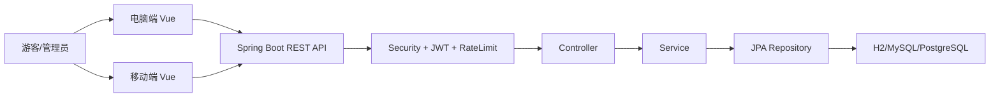
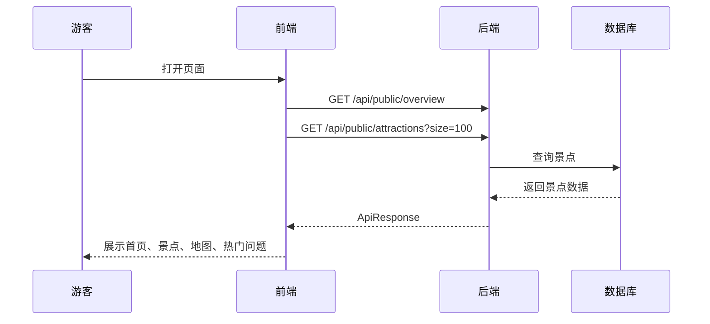
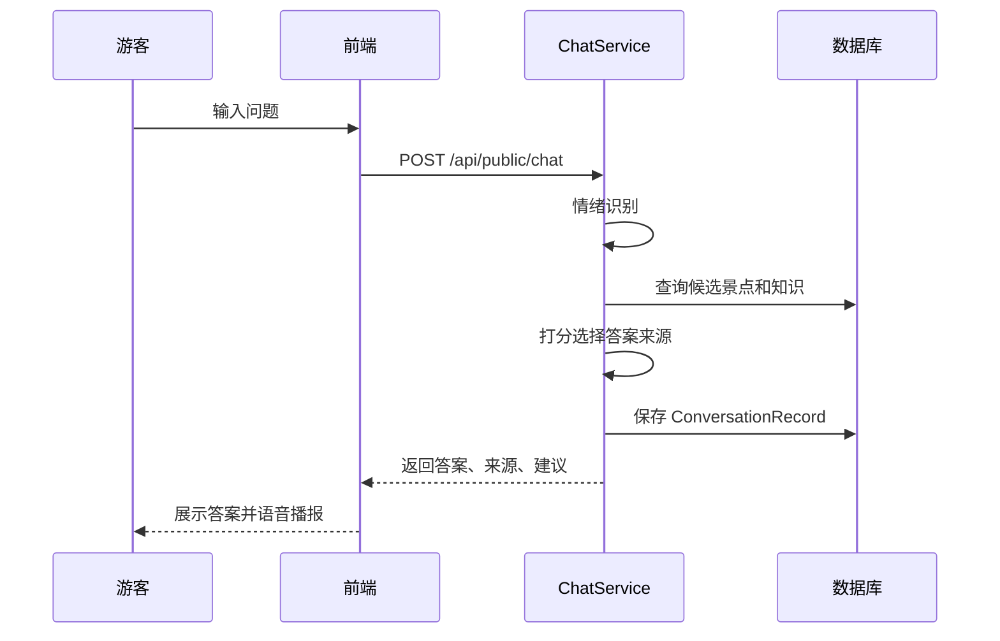
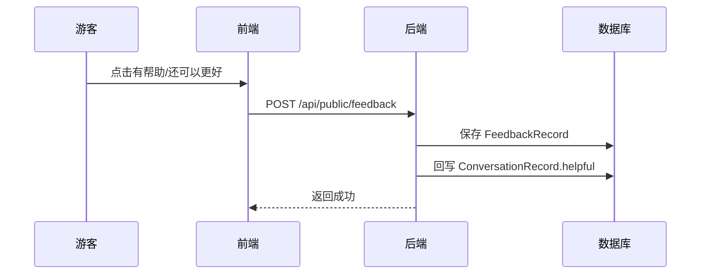
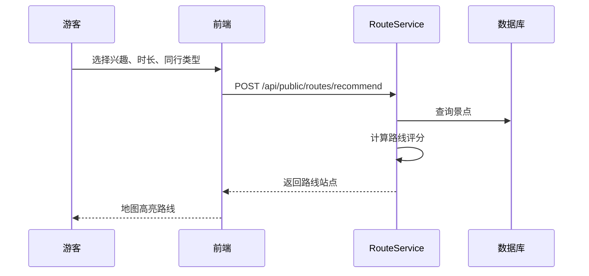
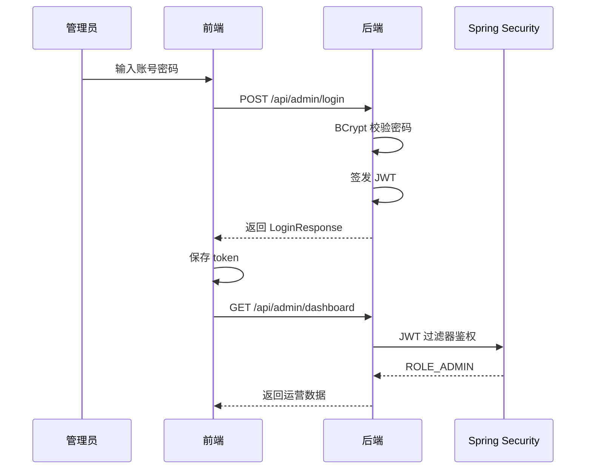
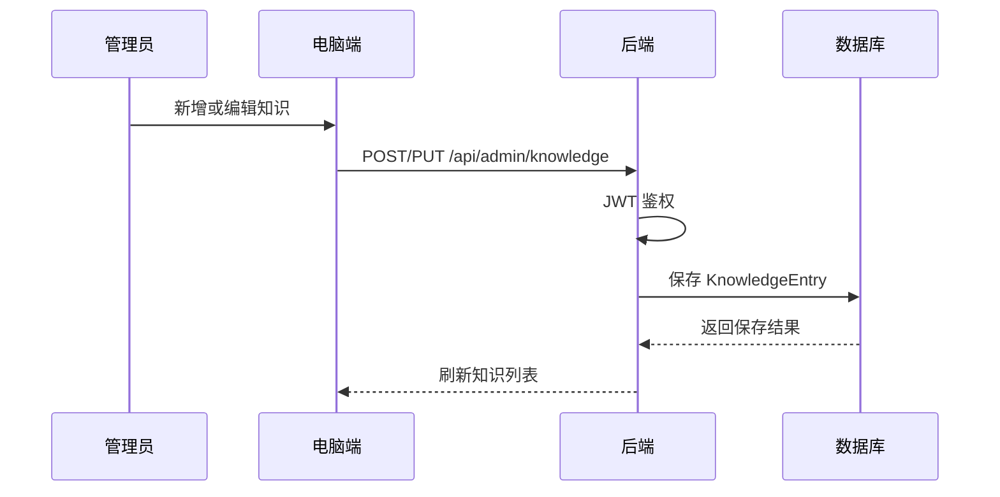

# 灵境智游项目知识点与流程说明

本文用于快速理解、讲解和答辩整个项目。内容覆盖后端、电脑端、移动端、两端差异、接口流程、异步流程、安全流程和关键代码。

## 1. 项目总览

灵境智游是一个前后端分离的灵山胜境数字导览系统，包含三个主要部分：

```text
C:\softbei
├─ scenic-ai-server        # Spring Boot 后端
├─ scenic-ai-web           # 电脑端 Vue 3 前端
└─ scenic-ai-web/mobile    # 移动端 Vue 3 前端
```

整体能力：

- 游客侧：景点展示、地图点位、智能问答、路线推荐、反馈提交。
- 管理侧：管理员登录、运营看板、问答记录、知识库维护。
- 数字人：Three.js 3D 数字人、语音播报、移动端听力输入。
- 安全：Spring Security、JWT、BCrypt、接口限流、CORS。
- 工程化：分页、统一响应、参数校验、JPA Auditing、健康检查。

整体请求链路：



## 2. 后端知识点

### 2.1 Spring Boot 启动入口

知识点：

- `@SpringBootApplication` 是 Spring Boot 主入口。
- `@EnableJpaAuditing` 开启 JPA 自动填充创建时间、更新时间。
- `main()` 调用 `SpringApplication.run()` 启动整个服务。

代码：

```java
@SpringBootApplication
@EnableJpaAuditing
public class ScenicAiApplication {

    public static void main(String[] args) {
        SpringApplication.run(ScenicAiApplication.class, args);
    }
}
```

答辩说明：

项目后端是标准 Spring Boot 架构，启动类负责加载 Web、JPA、安全、配置等所有 Bean，并启用实体审计能力。

### 2.2 REST Controller 分层

知识点：

- `PublicController` 面向游客，接口不需要登录。
- `AdminController` 面向管理员，除登录外需要 JWT。
- 使用 `/api/public` 和 `/api/v1/public` 双路径，支持接口版本化。
- 使用 `ApiResponse<T>` 统一返回格式。

代码：

```java
@RestController
@RequestMapping({"/api/public", "/api/v1/public"})
@RequiredArgsConstructor
public class PublicController {

    @GetMapping("/overview")
    public ApiResponse<Map<String, Object>> overview() {
        return ApiResponse.success(Map.of(
                "projectName", "灵境智游",
                "scenicName", "灵山胜境",
                "hotQuestions", List.of(
                        "灵山大佛有哪些必看的亮点？",
                        "九龙灌浴演出什么时候观看比较合适？",
                        "亲子游客怎么安排游览路线更轻松？"
                )
        ));
    }
}
```

管理员接口：

```java
@RestController
@RequestMapping({"/api/admin", "/api/v1/admin"})
@RequiredArgsConstructor
public class AdminController {

    @PostMapping("/login")
    public ApiResponse<LoginResponse> login(@Valid @RequestBody LoginRequest request) {
        return ApiResponse.success(adminService.login(request), "Login succeeded");
    }

    @GetMapping("/dashboard")
    public ApiResponse<?> dashboard() {
        return ApiResponse.success(adminService.getDashboard());
    }
}
```

答辩说明：

游客接口和管理员接口边界清晰，游客只访问导览能力，管理员访问运营数据和知识库维护。

### 2.3 统一响应结构

知识点：

- 前端不用分别处理各种返回格式。
- 后端成功、失败都包装成统一 JSON。
- 方便全局异常处理和前端提示。

典型返回结构：

```json
{
  "success": true,
  "data": {},
  "message": "OK"
}
```

前端消费方式：

```ts
const result = isJson
  ? (await response.json()) as ApiResponse<T>
  : null

if (!response.ok || !result?.success) {
  throw new Error(result?.message || '请求失败，请稍后重试')
}

return result.data
```

### 2.4 参数校验

知识点：

- Controller 入参使用 `@Valid`。
- DTO 使用校验注解，例如非空、长度限制。
- 无效请求在进入业务层前被拦截。

代码：

```java
@PostMapping("/chat")
public ApiResponse<ChatResponse> chat(@Valid @RequestBody ChatRequest request) {
    return ApiResponse.success(chatService.ask(request), "Answer generated");
}
```

```java
@PostMapping("/feedback")
public ApiResponse<String> feedback(@Valid @RequestBody FeedbackRequest request) {
    chatService.saveFeedback(request);
    return ApiResponse.success("Feedback received", "Thank you for the feedback");
}
```

答辩说明：

项目不是在 Service 里被动防空，而是在 Controller 层使用 Bean Validation 做统一入口校验。

### 2.5 Spring Security 安全控制

知识点：

- 关闭 Session，使用无状态 JWT。
- 游客接口公开。
- 管理员接口需要 `ROLE_ADMIN`。
- 登录接口公开。
- 健康检查公开。

代码：

```java
@Bean
public SecurityFilterChain securityFilterChain(HttpSecurity http) throws Exception {
    http
        .csrf(csrf -> csrf.disable())
        .sessionManagement(session -> session.sessionCreationPolicy(SessionCreationPolicy.STATELESS))
        .authorizeHttpRequests(auth -> auth
            .requestMatchers(HttpMethod.OPTIONS, "/**").permitAll()
            .requestMatchers("/actuator/health/**", "/actuator/info").permitAll()
            .requestMatchers("/api/admin/login", "/api/v1/admin/login").permitAll()
            .requestMatchers("/api/public/**", "/api/v1/public/**").permitAll()
            .requestMatchers("/api/admin/**", "/api/v1/admin/**").hasRole("ADMIN")
            .anyRequest().permitAll()
        )
        .addFilterBefore(rateLimitingFilter, UsernamePasswordAuthenticationFilter.class)
        .addFilterBefore(jwtAuthenticationFilter, UsernamePasswordAuthenticationFilter.class);

    return http.build();
}
```

答辩说明：

系统采用 JWT 无状态认证，适合前后端分离项目；管理员接口统一通过安全链路保护。

### 2.6 JWT 认证流程

知识点：

- 管理员登录后后端签发 JWT。
- 前端保存 token 到 `localStorage`。
- 后续请求通过 `Authorization: Bearer xxx` 携带。
- 后端过滤器解析 token 并写入 `SecurityContext`。

后端过滤器：

```java
String authorization = request.getHeader("Authorization");
if (authorization != null && authorization.startsWith("Bearer ")) {
    String token = authorization.substring("Bearer ".length()).trim();
    jwtService.verify(token).ifPresent(principal -> {
        var authorities = principal.roles().stream()
                .map(role -> role.startsWith("ROLE_") ? role : "ROLE_" + role)
                .map(SimpleGrantedAuthority::new)
                .toList();
        var authentication = new UsernamePasswordAuthenticationToken(principal.username(), null, authorities);
        SecurityContextHolder.getContext().setAuthentication(authentication);
    });
}
```

前端携带 token：

```ts
const token = localStorage.getItem('scenic-admin-token')
const response = await fetch(`${API_BASE}${path}`, {
  headers: {
    'Content-Type': 'application/json',
    ...(token ? { Authorization: `Bearer ${token}` } : {}),
  },
  ...init,
})
```

答辩说明：

登录后前端不依赖服务端 Session，所有管理员请求都通过 JWT 鉴权，便于水平扩展和移动端调用。

### 2.7 密码加密

知识点：

- 不保存明文密码。
- 使用 `BCryptPasswordEncoder` 校验密码。
- 配置中保存 password hash。

代码：

```java
@Bean
public PasswordEncoder passwordEncoder() {
    return new BCryptPasswordEncoder();
}
```

登录校验：

```java
if (!adminUsername.equals(request.username())
        || !passwordEncoder.matches(request.password(), adminPasswordHash)) {
    throw new ResponseStatusException(HttpStatus.UNAUTHORIZED, "Invalid username or password");
}
```

答辩说明：

后端不比较明文密码，而是比较 BCrypt 哈希，避免配置泄露后直接暴露管理员密码。

### 2.8 接口限流

知识点：

- `/api/public/chat` 是调用问答能力的高频接口。
- 使用 `OncePerRequestFilter` 做 IP 维度限流。
- 采用令牌桶思想。
- 超出限制返回 HTTP 429。

代码：

```java
private boolean isChatRequest(HttpServletRequest request) {
    String path = request.getRequestURI();
    return "POST".equalsIgnoreCase(request.getMethod())
            && ("/api/public/chat".equals(path) || "/api/v1/public/chat".equals(path));
}
```

```java
Bucket bucket = buckets.computeIfAbsent(key, ignored -> new Bucket(properties.chatBurst()));
if (!bucket.tryConsume(properties.chatPerMinute(), properties.chatBurst())) {
    response.setStatus(429);
    response.setContentType(MediaType.APPLICATION_JSON_VALUE);
    objectMapper.writeValue(response.getWriter(),
            ApiResponse.error("Too many chat requests, please try again later"));
    return;
}
```

答辩说明：

对游客问答接口做限流，是为了避免被恶意刷接口导致后端压力或大模型费用不可控。

### 2.9 CORS 跨域配置

知识点：

- 电脑端和移动端开发端口不同。
- 手机访问时是局域网 IP。
- 后端允许 localhost、127.0.0.1、192.168、10、172 网段。

代码：

```java
configuration.setAllowedOriginPatterns(List.of(
        "http://localhost:*",
        "http://127.0.0.1:*",
        "http://192.168.*:*",
        "http://10.*:*",
        "http://172.*:*"
));
configuration.setAllowedHeaders(List.of("*"));
configuration.setAllowedMethods(List.of("GET", "POST", "PUT", "DELETE", "OPTIONS"));
```

答辩说明：

移动端真机调试不是访问 `localhost`，而是访问电脑的局域网 IP，因此 CORS 必须支持局域网来源。

### 2.10 分页查询

知识点：

- 列表接口不直接返回全部数据。
- Controller 使用 `Pageable`。
- Repository 返回 `Page<T>`。

代码：

```java
@GetMapping("/attractions")
public ApiResponse<Page<Attraction>> attractions(@PageableDefault(size = 50) Pageable pageable) {
    return ApiResponse.success(adminService.listAttractions(pageable));
}
```

```java
@Transactional(readOnly = true)
public Page<Attraction> listAttractions(Pageable pageable) {
    return attractionRepository.findAllByOrderByPopularityScoreDesc(pageable);
}
```

前端兼容分页响应：

```ts
function pageContent<T>(page: PageResponse<T> | T[]): T[] {
  return Array.isArray(page) ? page : page.content
}
```

答辩说明：

分页能避免数据量上来后一次性查询和传输过多内容。

### 2.11 事务管理

知识点：

- 查询方法使用 `@Transactional(readOnly = true)`。
- 写操作使用 `@Transactional`。
- 问答记录和反馈保存需要事务保障。

代码：

```java
@Transactional
public KnowledgeEntry createKnowledge(KnowledgeRequest request) {
    KnowledgeEntry entry = KnowledgeEntry.builder()
            .title(request.title())
            .category(request.category())
            .content(request.content())
            .source(request.source())
            .published(request.published() == null || request.published())
            .build();
    return knowledgeEntryRepository.save(entry);
}
```

```java
@Transactional(readOnly = true)
public Page<KnowledgeEntry> listKnowledge(Pageable pageable) {
    return knowledgeEntryRepository.findAllByOrderByUpdatedAtDesc(pageable);
}
```

答辩说明：

Service 层控制事务边界，写操作保证一致性，查询操作使用只读事务减少额外开销。

### 2.12 JPA Auditing 自动时间

知识点：

- 实体的 `createdAt`、`updatedAt` 由 JPA 自动维护。
- 避免每个 Service 手动设置时间。

启动入口：

```java
@EnableJpaAuditing
public class ScenicAiApplication {
}
```

实体典型写法：

```java
@CreatedDate
@Column(nullable = false, updatable = false)
private LocalDateTime createdAt;

@LastModifiedDate
@Column(nullable = false)
private LocalDateTime updatedAt;
```

答辩说明：

审计字段是基础工程规范，便于运营记录追踪和后续排查问题。

### 2.13 智能问答匹配

知识点：

- 当前问答不是纯大模型，而是本地知识库和景点资料优先。
- 先做问题扩展，再匹配景点和知识库。
- 根据得分选择更合适的来源。
- 保存问答记录，供后台看板统计。

代码：

```java
@Transactional
public ChatResponse ask(ChatRequest request) {
    long start = System.currentTimeMillis();
    String question = request.question().trim();
    String matchingText = expandQuestionForMatching(question);
    String emotion = detectEmotion(question);

    Attraction attraction = findBestAttraction(matchingText);
    KnowledgeEntry knowledge = findBestKnowledge(matchingText);

    int attractionScore = attraction == null ? 0 : scoreAttraction(matchingText, attraction);
    int knowledgeScore = knowledge == null ? 0 : scoreKnowledge(matchingText, knowledge);
    boolean preferKnowledge = shouldPreferKnowledge(question);

    // 根据得分选择景点资料或知识库答案
}
```

英文问题扩展：

```java
if (lower.contains("nine dragons") || lower.contains("sakyamuni") || lower.contains("bathing")) {
    expanded.append(" 九龙灌浴 演出 表演 观看 观演 建议 几点 时间");
}
if (lower.contains("lingshan grand buddha") || lower.contains("grand buddha")) {
    expanded.append(" 灵山大佛 大佛 亮点 介绍");
}
```

答辩说明：

系统优先依据本地资料回答，保证景区内容准确可控；英文问题通过关键词扩展映射到中文知识库。

### 2.14 情绪识别

知识点：

- 轻量规则识别游客问题情绪。
- 根据情绪调整回答语气。
- 结果保存到运营记录中。

代码：

```java
private String detectEmotion(String question) {
    if (containsAny(question, "赶时间", "来不及", "快点", "马上", "着急")) {
        return "着急";
    }
    if (containsAny(question, "怎么", "哪里", "为啥", "为什么", "吗", "？", "?")) {
        return "疑惑";
    }
    if (containsAny(question, "喜欢", "太好了", "不错", "开心")) {
        return "开心";
    }
    if (containsAny(question, "失望", "不好", "麻烦")) {
        return "不满";
    }
    return "中性";
}
```

答辩说明：

情绪识别用于增强回答语气，也能在后台统计游客咨询情绪分布。

### 2.15 问答记录与反馈闭环

知识点：

- 每次问答保存 `ConversationRecord`。
- 用户反馈保存 `FeedbackRecord`。
- 反馈会回写到对应问答记录的 `helpful` 字段。

代码：

```java
ConversationRecord saved = conversationRecordRepository.save(ConversationRecord.builder()
        .sessionId(Optional.ofNullable(request.sessionId()).filter(v -> !v.isBlank()).orElse("guest-session"))
        .question(question)
        .answer(answer)
        .emotion(emotion)
        .matchedSource(matchedSource)
        .sourceType(sourceType)
        .responseMillis(responseMillis)
        .build());
```

```java
feedbackRecordRepository.save(feedback);

conversationRecordRepository.findById(request.recordId()).ifPresent(record -> {
    record.setHelpful(Boolean.TRUE.equals(request.helpful()));
    conversationRecordRepository.save(record);
});
```

答辩说明：

游客不是只问一次就结束，而是形成“提问、回答、反馈、运营复盘”的闭环。

### 2.16 路线推荐

知识点：

- 根据兴趣、时长、节奏、同行类型评分。
- 按得分排序选出路线点位。
- 返回路线标题、总时长、站点和提示。

代码：

```java
int stopCount = durationHours <= 4 ? 3 : durationHours <= 6 ? 4 : 5;

List<Attraction> selected = attractionRepository.findAll().stream()
        .sorted(Comparator.comparingInt((Attraction item) ->
                score(item, interests, pace, companionType)).reversed())
        .limit(stopCount)
        .collect(Collectors.toList());
```

评分规则：

```java
if ("轻松".equals(pace)) {
    score -= attraction.getWalkingIntensity() * 8;
}
if ("亲子".equals(companionType) && attraction.getTags().contains("亲子")) {
    score += 20;
}
if ("长辈".equals(companionType) && attraction.getWalkingIntensity() <= 2) {
    score += 15;
}
```

答辩说明：

路线推荐不是随机返回，而是综合标签匹配、热度、步行强度和同行类型计算。

### 2.17 TTS ——文本转语音

知识点：

- 移动端支持服务端 TTS。
- 后端 TTS provider 可配置。
- Windows provider 使用 PowerShell 调用系统语音。
- 非 Windows 或未启用时返回未实现。

代码：

```java
@PostMapping("/tts")
public ResponseEntity<byte[]> tts(@Valid @RequestBody TtsRequest request) {
    byte[] audio = ttsService.synthesize(request.text(), request.voiceName());
    return ResponseEntity.ok()
            .contentType(MediaType.parseMediaType("audio/wav"))
            .body(audio);
}
```

PowerShell 生成语音：

```java
String script = """
        Add-Type -AssemblyName System.Speech
        $s = New-Object System.Speech.Synthesis.SpeechSynthesizer
        if ($env:TTS_VOICE) {
          $s.SelectVoice($env:TTS_VOICE)
        }
        $s.SetOutputToWaveFile($env:TTS_OUTPUT)
        $s.Speak($env:TTS_TEXT)
        $s.Dispose()
        """;
```

答辩说明：

移动端为了避免浏览器音色差异，提供服务端语音合成作为可选通道。

### 2.18 健康检查

知识点：

- 使用 Spring Boot Actuator。
- `/actuator/health` 可用于判断服务是否存活。

安全配置：

```java
.requestMatchers("/actuator/health/**", "/actuator/info").permitAll()
```

答辩说明：

部署后可以通过健康检查接口判断后端是否正常运行。

## 3. 电脑端前端知识点

### 3.1 Vue 3 Composition API

知识点：

- 使用 `<script setup>`。
- 使用 `ref`、`reactive`、`computed` 管理状态。
- 使用组件拆分地图、数字人和动效。

代码：

```ts
const overview = ref<Overview | null>(null)
const attractions = ref<Attraction[]>([])
const publicLoading = ref(false)
const publicError = ref('')

const chatForm = reactive({
  question: '',
  sessionId: 'web-guest',
})
```

答辩说明：

电脑端采用 Vue 3 Composition API，状态和业务函数集中在页面逻辑中，地图、数字人、动效拆成组件。

### 3.2 前端 API 封装

知识点：

- 所有接口调用统一走 `request<T>()`。
- 自动携带管理员 token。
- 统一处理 401/403、非 JSON 异常和分页数据。

代码：

```ts
async function request<T>(path: string, init?: RequestInit): Promise<T> {
  const token = localStorage.getItem('scenic-admin-token')
  const response = await fetch(`${API_BASE}${path}`, {
    credentials: 'same-origin',
    headers: {
      'Content-Type': 'application/json',
      ...(token ? { Authorization: `Bearer ${token}` } : {}),
      ...(init?.headers ?? {}),
    },
    ...init,
  })
}
```

答辩说明：

前端没有在每个页面重复写 `fetch`，而是通过统一 API 层管理请求、认证和异常提示。

### 3.3 异步数据加载

知识点：

- 使用 `async/await` 调接口。
- 使用 `Promise.all` 并行加载无依赖数据。
- 避免串行等待。

代码：

```ts
async function loadPublicData() {
  publicLoading.value = true
  publicError.value = ''
  try {
    const [overviewData, attractionData] = await Promise.all([
      fetchOverview(),
      fetchAttractions(),
    ])
    overview.value = overviewData
    attractions.value = attractionData
  } finally {
    publicLoading.value = false
  }
}
```

答辩说明：

前端接口请求是异步的，游客数据、后台数据都使用异步加载，提升页面响应速度。

### 3.4 管理员登录状态

知识点：

- 登录后保存 token 和 profile。
- 刷新页面后恢复登录状态。
- 退出时清理本地缓存。

代码：

```ts
function persistAdminSession(profile: LoginResponse | null) {
  if (!profile) {
    localStorage.removeItem('scenic-admin-profile')
    localStorage.removeItem('scenic-admin-token')
    return
  }
  localStorage.setItem('scenic-admin-profile', JSON.stringify(profile))
  localStorage.setItem('scenic-admin-token', profile.token)
}
```

答辩说明：

电脑端后台不是依赖页面临时状态，刷新后能从本地恢复管理员会话。

### 3.5 智能问答交互

知识点：

- 提交问题调用 `/api/public/chat`。
- 回答后自动播报。
- 支持反馈“有帮助/还可以更好”。

代码：

```ts
async function submitChat(question?: string) {
  if (question) {
    chatForm.question = question
  }
  if (!chatForm.question.trim()) {
    chatError.value = '请输入你想咨询的问题'
    return
  }

  chatResponse.value = await askQuestion({
    question: chatForm.question.trim(),
    sessionId: chatForm.sessionId,
  })
  announce(chatResponse.value.answer)
}
```

答辩说明：

问答功能不是静态展示，而是前端提交问题、后端匹配资料、返回答案、前端播报并收集反馈。

### 3.6 浏览器语音播报

知识点：

- 使用 Web Speech API 的 `speechSynthesis`。
- 自动选择中文音色。
- 支持暂停、自动播报。

代码：

```ts
const speechSupported = typeof window !== 'undefined' && 'speechSynthesis' in window

const utterance = new SpeechSynthesisUtterance(text)
utterance.lang = 'zh-CN'
utterance.rate = 0.92
utterance.pitch = 1.04
window.speechSynthesis.speak(utterance)
```

答辩说明：

电脑端语音播报优先走浏览器能力，减少后端依赖。

### 3.7 电脑端听力输入

知识点：

- 使用 `SpeechRecognition` 或 `webkitSpeechRecognition`。
- 识别中文。
- 识别结果自动填入问题并提交。

代码：

```ts
const hearingSupported =
  typeof window !== 'undefined'
  && ('SpeechRecognition' in window || 'webkitSpeechRecognition' in window)

nextRecognition.lang = 'zh-CN'
nextRecognition.continuous = false
nextRecognition.interimResults = true
nextRecognition.maxAlternatives = 1
```

答辩说明：

电脑端数字人不只是播报，也能听游客提问，形成语音交互闭环。

### 3.8 Three.js 数字人

知识点：

- 使用 Three.js 渲染数字人。
- 使用 `GLTFLoader` 加载 GLB 模型。
- 使用 `requestAnimationFrame` 做动画循环。
- 数字人皮肤通过颜色参数切换。

代码：

```ts
import * as THREE from 'three'
import { GLTFLoader } from 'three/examples/jsm/loaders/GLTFLoader.js'

let renderer: THREE.WebGLRenderer | null = null
let scene: THREE.Scene | null = null
let camera: THREE.PerspectiveCamera | null = null
let avatarRoot: THREE.Group | null = null
```

动画：

```ts
function animate(time: number) {
  renderer.render(scene, camera)
  frameId = requestAnimationFrame(animate)
}
```

答辩说明：

数字人是前端 3D 渲染，不是图片贴图；它支持换装、拖拽和说话状态动画。

### 3.9 Leaflet 地图

知识点：

- 使用 Leaflet 加载高德地图瓦片。
- 景点以点位展示。
- 路线站点用编号 marker。
- 推荐路线用 polyline 连接。
- 使用 `requestAnimationFrame` 调度地图重绘。

代码：

```ts
map = L.map(hostRef.value, {
  zoomControl: true,
  attributionControl: false,
  preferCanvas: true,
  fadeAnimation: false,
  zoomAnimation: true,
}).setView(DEFAULT_CENTER, DEFAULT_ZOOM)
```

路线绘制：

```ts
const line = L.polyline(
  routeAttractions.value.map((item) => [item.latitude!, item.longitude!] as [number, number]),
  {
    color: '#c57958',
    weight: 4,
    opacity: 0.9,
    dashArray: '10 8',
  },
)
line.addTo(activeRouteLayer)
```

答辩说明：

地图不是简单截图，而是动态点位和路线绘制。

### 3.10 运营看板

知识点：

- 展示问答总量、反馈总量、平均响应、满意度。
- 展示情绪分布、热门景点、热门问题、最近记录。
- 需要管理员登录。

前端调用：

```ts
export function fetchDashboard() {
  return request<DashboardResponse>('/api/admin/dashboard')
}
```

后端统计：

```java
long conversationCount = records.size();
long feedbackCount = feedbacks.size();
long avgResponseMillis = records.isEmpty() ? 0L : Math.round(records.stream()
        .mapToLong(record -> record.getResponseMillis() == null ? 0L : record.getResponseMillis())
        .average()
        .orElse(0));
```

答辩说明：

后台看板把游客问答和反馈转成运营指标，体现项目不只是游客页面，也有管理闭环。

### 3.11 知识库维护

知识点：

- 电脑端支持新增、编辑、删除知识条目。
- 知识库参与问答匹配。
- 管理员登录后可操作。

API 封装：

```ts
export function createKnowledge(payload: {
  title: string
  category: string
  keywords: string[]
  content: string
  source: string
  published: boolean
}) {
  return request<KnowledgeEntry>('/api/admin/knowledge', {
    method: 'POST',
    body: JSON.stringify(payload),
  })
}
```

答辩说明：

知识库维护让系统内容可以持续更新，不需要重新发版才能补充问答资料。

## 4. 移动端前端知识点

### 4.1 移动端独立项目

知识点：

- 移动端在 `scenic-ai-web/mobile` 下。
- 与电脑端共用后端接口。
- 有独立 `package.json`、`vite.config.ts`、`src`。
- UI 风格与电脑端统一，但交互更偏移动端。

目录：

```text
scenic-ai-web/mobile
├─ src/App.vue
├─ src/api.ts
├─ src/components/DigitalHumanStage.vue
├─ src/components/ScenicMap.vue
└─ src/types.ts
```

答辩说明：

移动端不是简单缩放电脑端页面，而是独立入口，针对手机访问、手机语音、手机地图做了适配。

### 4.2 移动端 API 地址适配

知识点：

- 电脑端可以同源代理或 localhost。
- 手机访问电脑服务时，不能请求手机自己的 `localhost`。
- 移动端默认根据当前页面 hostname 拼接 `8080` 后端端口。

代码：

```ts
function resolveApiBase() {
  const configuredApiBase = (import.meta.env.VITE_API_BASE ?? '').trim().replace(/\/$/, '')
  if (configuredApiBase) {
    return configuredApiBase
  }
  if (typeof window === 'undefined') {
    return 'http://localhost:8080'
  }
  const { protocol, hostname } = window.location
  const apiProtocol = protocol === 'https:' ? 'https:' : 'http:'
  return `${apiProtocol}//${hostname}:8080`
}
```

答辩说明：

如果手机访问 `http://192.168.1.7:5174`，移动端会自动请求 `http://192.168.1.7:8080`，避免 `Failed to fetch`。

### 4.3 移动端管理员入口

知识点：

- 移动端也能登录管理员。
- 未登录时运营模块显示温和提示。
- 登录后刷新后台摘要。

代码：

```ts
async function loginToAdmin() {
  if (!adminForm.username.trim() || !adminForm.password.trim()) {
    adminMessage.value = '请输入管理员账号和密码。'
    return
  }

  const profile = await adminLogin({
    username: adminForm.username.trim(),
    password: adminForm.password,
  })
  adminProfile.value = profile
  persistAdminSession(profile)
  await loadAdminData()
}
```

答辩说明：

移动端不是只能给游客用，也保留了轻量运营入口，方便现场演示。

### 4.4 移动端数字人名称

知识点：

- 数字人统一叫“小灵”。
- 文案通过 `assistantName` 统一维护。
- 避免电脑端和移动端名称不一致。

代码：

```ts
const assistantName = '小灵'

const spokenContent = ref(`${assistantName}已就位，可以随时开始讲解。`)
const narratorMessage = ref(`${assistantName}待机中。`)
```

答辩说明：

数字人身份统一，游客在电脑端和移动端看到的是同一个导览助手“小灵”。

### 4.5 移动端听力输入

知识点：

- 移动端数字人面板支持“开启听力”。
- 使用浏览器 `SpeechRecognition`。
- 识别中文后自动提交问答。
- 浏览器不支持时显示提示。

代码：

```ts
const hearingSupported =
  typeof window !== 'undefined'
  && ('SpeechRecognition' in window || 'webkitSpeechRecognition' in window)

function openHearing() {
  if (!hearingSupported) {
    narratorMessage.value = '当前浏览器暂不支持语音输入，请使用最新版 Edge 或 Chrome。'
    return
  }
  hearingEnabled.value = true
  startListening()
}
```

识别结果：

```ts
nextRecognition.onresult = (event) => {
  let mergedTranscript = ''
  for (let index = 0; index < event.results.length; index += 1) {
    const result = event.results[index]
    const segment = result[0]?.transcript ?? ''
    mergedTranscript += segment
    if (result.isFinal) {
      finalTranscript += segment
    }
  }

  const transcript = (finalTranscript || mergedTranscript).trim()
  recognitionTranscript.value = transcript
  chatForm.question = transcript
}
```

答辩说明：

移动端能通过麦克风让“小灵”听游客说话，但 iOS Safari 支持不稳定，安卓 Chrome/Edge 更可靠。

### 4.6 移动端服务端 TTS

知识点：

- 移动端支持浏览器语音和服务端语音两种通道。
- 服务端语音通过 `/api/public/tts` 返回 wav。
- 前端使用 `Audio` 播放 blob。

代码：

```ts
export async function synthesizeSpeech(payload: {
  text: string
  voiceName?: string
}) {
  const response = await fetch(`${API_BASE}/api/public/tts`, {
    method: 'POST',
    headers: {
      'Content-Type': 'application/json',
    },
    body: JSON.stringify(payload),
  })

  return await response.blob()
}
```

播放：

```ts
activeAudioUrl = URL.createObjectURL(blob)
activeAudio = new Audio(activeAudioUrl)
activeAudio.preload = 'auto'
await activeAudio.play()
```

答辩说明：

移动端语音方案更完整，因为手机浏览器音色差异大，所以提供服务端语音兜底。

### 4.7 移动端地图性能优化

知识点：

- 默认中心点先显示，避免空白等待。
- Leaflet 开启 `preferCanvas`。
- 瓦片 `keepBuffer` 提升拖动体验。
- 使用 `requestAnimationFrame` 合并渲染。

代码：

```ts
map = L.map(hostRef.value, {
  zoomControl: true,
  attributionControl: false,
  preferCanvas: true,
  fadeAnimation: false,
  zoomAnimation: true,
}).setView(DEFAULT_CENTER, DEFAULT_ZOOM)
```

```ts
function scheduleRender() {
  if (renderFrame) {
    window.cancelAnimationFrame(renderFrame)
  }
  renderFrame = window.requestAnimationFrame(() => {
    renderFrame = 0
    renderMap()
  })
}
```

答辩说明：

移动端地图加载慢的问题通过默认视角、Canvas 渲染和合并重绘做了优化。

### 4.8 移动端 UI 适配

知识点：

- 移动端采用电脑端同一套视觉语言。
- 8px 圆角、浅色卡片、绿色主按钮、金色强调。
- 手机宽度下导航改为两列，避免横向溢出。

代码：

```css
.section-card,
.stat-card,
.attraction-card,
.response-card,
.source-card,
.record-card,
.assistant-sheet {
  border: 1px solid var(--line);
  border-radius: 8px;
  background:
    linear-gradient(180deg, rgba(255, 255, 255, 0.96), rgba(241, 247, 237, 0.92)),
    var(--surface);
}
```

手机导航：

```css
@media (max-width: 520px) {
  .mobile-nav-strip {
    grid-template-columns: repeat(2, minmax(0, 1fr));
  }
}
```

答辩说明：

移动端不是另一套风格，而是电脑端视觉体系的响应式落地。

## 5. 电脑端与移动端差异

### 5.1 入口差异

电脑端：

```text
scenic-ai-web/src/App.vue
```

移动端：

```text
scenic-ai-web/mobile/src/App.vue
```

说明：

- 电脑端偏完整管理台和展示台。
- 移动端偏游客随身导览和轻量运营入口。

### 5.2 API 地址差异

电脑端：

```ts
const configuredApiBase = (import.meta.env.VITE_API_BASE ?? '').trim().replace(/\/$/, '')
const API_BASE = configuredApiBase
```

移动端：

```ts
const { protocol, hostname } = window.location
return `${apiProtocol}//${hostname}:8080`
```

说明：

- 电脑端本地调试可依赖同源代理或环境变量。
- 移动端需要适配手机访问电脑局域网 IP。

### 5.3 管理能力差异

电脑端：

- 完整后台看板。
- 完整知识库新增、编辑、删除。
- 更适合管理员维护。

移动端：

- 轻量管理员入口。
- 只展示运营摘要和最近问答记录。
- 不提供完整知识库编辑。

移动端登录代码：

```ts
const adminProfile = ref<LoginResponse | null>(null)
const adminForm = reactive({
  username: 'admin',
  password: '',
})
```

### 5.4 数字人差异

电脑端：

- 数字人悬浮展示。
- 展开后显示完整控制台。
- 语音播报和听力输入。
- 浏览器语音为主。

移动端：

- 数字人固定右下角。
- 控制面板从底部弹出。
- 支持服务端 TTS 和浏览器语音。
- 新增手机听力输入。

移动端控制台：

```html
<p class="section-kicker">小灵控制台</p>
<h2>声音、播报和听力</h2>
```

### 5.5 地图差异

共同点：

- 都使用 Leaflet。
- 都展示景点点位和路线高亮。

移动端额外优化：

- 默认中心点。
- `preferCanvas`。
- `keepBuffer`。
- 防重复 `fitBounds`。

代码：

```ts
const DEFAULT_CENTER: L.LatLngExpression = [31.4316, 120.0918]
const DEFAULT_ZOOM = 16
let lastBoundsKey = ''
```

### 5.6 UI 差异

共同点：

- 同一套色彩体系。
- 同一套卡片语言。
- 同一套按钮和强调色。

移动端差异：

- 单列信息流。
- 首屏 hero 纵向排列。
- 数字人缩小悬浮。
- 导航在小屏变成两列。

### 5.7 包体积差异

电脑端和移动端都有大 chunk 警告，原因不是目录嵌套，而是依赖较重：

- Three.js 数字人。
- Leaflet 地图。
- 动效组件。
- 单页逻辑集中。

后续优化：

```ts
// 可改成动态导入
const DigitalHumanStage = defineAsyncComponent(() => import('./components/DigitalHumanStage.vue'))
```

## 6. 完整业务流程

### 6.1 游客打开首页

流程：



关键代码：

```ts
const [overviewData, attractionData] = await Promise.all([
  fetchOverview(),
  fetchAttractions(),
])
overview.value = overviewData
attractions.value = attractionData
```

### 6.2 游客提问

流程：



前端代码：

```ts
chatResponse.value = await askQuestion({
  question: chatForm.question.trim(),
  sessionId: chatForm.sessionId,
})
announce(chatResponse.value.answer)
```

后端代码：

```java
String emotion = detectEmotion(question);
Attraction attraction = findBestAttraction(matchingText);
KnowledgeEntry knowledge = findBestKnowledge(matchingText);
```

### 6.3 游客提交反馈

流程：



代码：

```ts
await submitFeedback({
  recordId: chatResponse.value.recordId,
  helpful,
  comment: feedbackComment.value.trim(),
})
```

```java
conversationRecordRepository.findById(request.recordId()).ifPresent(record -> {
    record.setHelpful(Boolean.TRUE.equals(request.helpful()));
    conversationRecordRepository.save(record);
});
```

### 6.4 路线推荐

流程：



代码：

```ts
routeResponse.value = await recommendRoute({
  interests: routeForm.interests,
  durationHours: routeForm.durationHours,
  pace: routeForm.pace,
  companionType: routeForm.companionType,
})
```

```java
List<Attraction> selected = attractionRepository.findAll().stream()
        .sorted(Comparator.comparingInt((Attraction item) ->
                score(item, interests, pace, companionType)).reversed())
        .limit(stopCount)
        .collect(Collectors.toList());
```

### 6.5 管理员登录

流程：



代码：

```ts
const profile = await adminLogin({
  username: adminForm.username.trim(),
  password: adminForm.password,
})
localStorage.setItem('scenic-admin-token', profile.token)
```

```java
return new LoginResponse(
        jwtService.issueAdminToken(request.username(), List.of("ADMIN")),
        adminDisplayName,
        List.of("ADMIN")
);
```

### 6.6 后台知识库维护

流程：



代码：

```ts
await createKnowledge(payload)
await loadAdminData()
```

```java
@PostMapping("/knowledge")
public ApiResponse<KnowledgeEntry> createKnowledge(@Valid @RequestBody KnowledgeRequest request) {
    return ApiResponse.success(adminService.createKnowledge(request), "Knowledge entry created");
}
```

### 6.7 移动端真机访问流程

流程：

```text
电脑后端：http://192.168.1.7:8080
电脑移动端：http://192.168.1.7:5174
手机访问：http://192.168.1.7:5174
移动端自动请求：http://192.168.1.7:8080/api/...
```

代码：

```ts
const { protocol, hostname } = window.location
return `${apiProtocol}//${hostname}:8080`
```

注意点：

- 手机和电脑必须在同一 Wi-Fi。
- Windows 防火墙要允许 5174 和 8080。
- 手机不能请求 `localhost:8080`，那会指向手机自己。

## 7. 异步知识点

### 7.1 前端异步请求

代码：

```ts
async function request<T>(path: string, init?: RequestInit): Promise<T> {
  const response = await fetch(`${API_BASE}${path}`, init)
  const result = await response.json()
  return result.data
}
```

说明：

前端所有接口调用都是异步的，不会阻塞页面主线程。

### 7.2 并行加载

代码：

```ts
const [dashboardData, recordData] = await Promise.all([
  fetchDashboard(),
  fetchRecords(),
])
```

说明：

多个互不依赖接口并行请求，比串行请求更快。

### 7.3 动画异步渲染

代码：

```ts
frameId = requestAnimationFrame(animate)
```

说明：

地图、数字人、背景动效都使用浏览器动画帧调度，避免手动定时器造成卡顿。

### 7.4 后端异步情况

当前后端没有使用：

```text
@Async
CompletableFuture
Mono / Flux
WebFlux
```

说明：

后端目前是 Spring MVC 同步接口，优点是链路稳定、易于调试。后续如果接入真正耗时的大模型，可以引入 `@Async`、线程池、消息队列。

## 8. 可对评委说明的技术亮点

### 8.1 安全性

要点：

- Spring Security。
- JWT 无状态认证。
- BCrypt 密码加密。
- 管理员接口权限保护。
- 问答接口限流。

示例说明：

```text
管理员登录后拿到 JWT，后续后台接口都必须携带 Bearer Token。游客接口公开，但问答接口有 IP 限流，防止恶意刷接口。
```

### 8.2 可维护性

要点：

- 前后端接口统一。
- Controller、Service、Repository 分层。
- DTO 独立。
- 前端 API 统一封装。
- 移动端独立入口。

示例说明：

```text
后端遵循 Controller-Service-Repository 分层，前端统一通过 api.ts 调接口，避免每个页面重复处理 token 和错误。
```

### 8.3 性能优化

要点：

- 分页接口。
- 地图 Canvas 渲染。
- 地图重绘合并。
- 移动端 API 地址自动适配。
- 前端并行请求。

示例说明：

```text
列表接口使用分页，地图使用 preferCanvas 和 requestAnimationFrame，移动端避免重复 fitBounds，提升手机端地图流畅度。
```

### 8.4 业务闭环

要点：

- 景点资料展示。
- 问答。
- 反馈。
- 记录。
- 看板。
- 知识库维护。

示例说明：

```text
游客咨询会被记录，游客反馈会回写问答记录，后台看板统计满意度和热门问题，管理员可以继续补充知识库。
```

## 9. 常见问题答辩

### 问：为什么不用纯大模型回答？

答：

当前系统优先依据本地景区资料和知识库回答，保证景区信息准确、可控、可追溯。后续可以把大模型作为补充生成层，但核心事实仍由本地知识库提供。

### 问：移动端为什么单独一个项目？

答：

移动端有真机访问、手机麦克风、服务端 TTS、右下角数字人悬浮、局域网 API 地址适配等独立需求，所以单独入口更容易优化体验。

### 问：为什么手机之前会 Failed to fetch？

答：

因为手机访问页面时，`localhost` 指向手机自己，不是电脑后端。现在移动端会根据当前页面 IP 自动拼接后端地址，例如 `192.168.1.7:8080`。

### 问：大 chunk 警告是什么？

答：

这是 Vite 的包体积提醒，不是构建错误。原因是项目使用了 Three.js、Leaflet 和动效组件。后续可以通过动态 import 拆分数字人和地图模块。

### 问：后端有没有异步？

答：

后端当前是同步 Spring MVC，前端大量使用异步请求和动画调度。后续接入耗时大模型时，可以在后端引入 `@Async`、线程池或消息队列。

### 问：TTS 在 Linux 服务器怎么办？

答：

当前 Windows provider 是可配置能力，默认可关闭。生产环境可以接入云语音服务或 Linux 可用的 TTS 引擎，前端接口不需要改，只要后端实现 `/api/public/tts` 即可。

## 10. 代码所在文件位置索引

下面这一节用于补充前文各段示例代码对应的真实源码位置，方便查找和答辩时快速定位。`README.md` 不涉及这里的索引说明。

### 10.1 后端知识点对应文件

- `2.1 Spring Boot 启动入口`
  - `scenic-ai-server/src/main/java/com/softbei/scenicai/ScenicAiApplication.java`
- `2.2 REST Controller 分层`
  - `scenic-ai-server/src/main/java/com/softbei/scenicai/controller/PublicController.java`
  - `scenic-ai-server/src/main/java/com/softbei/scenicai/controller/AdminController.java`
- `2.3 统一响应结构`
  - `scenic-ai-server/src/main/java/com/softbei/scenicai/dto/ApiResponse.java`
- `2.4 参数校验`
  - `scenic-ai-server/src/main/java/com/softbei/scenicai/dto/ChatRequest.java`
  - `scenic-ai-server/src/main/java/com/softbei/scenicai/dto/LoginRequest.java`
  - `scenic-ai-server/src/main/java/com/softbei/scenicai/controller/AdminController.java`
- `2.5 Spring Security 安全控制`
  - `scenic-ai-server/src/main/java/com/softbei/scenicai/config/SecurityConfig.java`
- `2.6 JWT 认证流程`
  - `scenic-ai-server/src/main/java/com/softbei/scenicai/security/JwtAuthenticationFilter.java`
  - `scenic-ai-server/src/main/java/com/softbei/scenicai/security/JwtService.java`
- `2.7 密码加密`
  - `scenic-ai-server/src/main/java/com/softbei/scenicai/service/AdminService.java`
  - `scenic-ai-server/src/main/resources/application.yml`
  - `scenic-ai-server/src/main/resources/application-dev.yml`
- `2.8 接口限流`
  - `scenic-ai-server/src/main/java/com/softbei/scenicai/filter/RateLimitFilter.java`
  - 如果你的本地分支里该类已调整目录，也优先看 `scenic-ai-server/src/main/java/com/softbei/scenicai/` 下的 `RateLimit` 相关类
- `2.9 CORS 跨域配置`
  - `scenic-ai-server/src/main/java/com/softbei/scenicai/config/CorsConfig.java`
- `2.10 分页查询`
  - `scenic-ai-server/src/main/java/com/softbei/scenicai/controller/AdminController.java`
  - `scenic-ai-server/src/main/java/com/softbei/scenicai/repository/AttractionRepository.java`
  - `scenic-ai-server/src/main/java/com/softbei/scenicai/repository/KnowledgeEntryRepository.java`
- `2.11 事务管理`
  - `scenic-ai-server/src/main/java/com/softbei/scenicai/service/ChatService.java`
  - `scenic-ai-server/src/main/java/com/softbei/scenicai/service/AdminService.java`
  - `scenic-ai-server/src/main/java/com/softbei/scenicai/service/RouteService.java`
- `2.12 JPA Auditing 自动审计时间`  **Java Persistence API**  Java 持久化应用程序接口 
- 四个实体全部引入 JPA Auditing 自动时间，统一维护 `createdAt` 创建时间、`updatedAt` 更新时间，业务层不用手动赋值时间，减少重复代码；
- Attraction 存储景区点位基础数据，支撑地图、路线推荐、问答匹配；
- KnowledgeEntry 是官方问答知识库，由管理员维护，保证导览回答内容准确；
- ConversationRecord、FeedbackRecord 构成游客交互日志体系，所有问答、评价永久入库，为运营看板提供统计数据源；
- 可快速追溯每条数据录入、修改时间，方便后期问题排查与运营数据分析。
  - `scenic-ai-server/src/main/java/com/softbei/scenicai/model/Attraction.java`
  - `scenic-ai-server/src/main/java/com/softbei/scenicai/model/KnowledgeEntry.java`
  - `scenic-ai-server/src/main/java/com/softbei/scenicai/model/ConversationRecord.java`
  - `scenic-ai-server/src/main/java/com/softbei/scenicai/model/FeedbackRecord.java`
- `2.13 智能问答匹配`
  - `scenic-ai-server/src/main/java/com/softbei/scenicai/service/ChatService.java`
  - `scenic-ai-server/src/main/java/com/softbei/scenicai/repository/AttractionRepository.java`
  - `scenic-ai-server/src/main/java/com/softbei/scenicai/repository/KnowledgeEntryRepository.java`
- `2.14 情绪识别`
  - `scenic-ai-server/src/main/java/com/softbei/scenicai/service/ChatService.java`
- `2.15 问答记录与反馈闭环`
  - `scenic-ai-server/src/main/java/com/softbei/scenicai/service/ChatService.java`
  - `scenic-ai-server/src/main/java/com/softbei/scenicai/repository/ConversationRecordRepository.java`
  - `scenic-ai-server/src/main/java/com/softbei/scenicai/repository/FeedbackRecordRepository.java`
- `2.16 路线推荐`
  - `scenic-ai-server/src/main/java/com/softbei/scenicai/service/RouteService.java`
- `2.17 TTS`
  - `scenic-ai-server/src/main/java/com/softbei/scenicai/service/TtsService.java`
  - `scenic-ai-server/src/main/java/com/softbei/scenicai/controller/PublicController.java`
- `2.18 健康检查`
  - `scenic-ai-server/src/main/resources/application.yml`

### 10.2 电脑端前端知识点对应文件

- `3.1 Vue 3 Composition API`
  - `scenic-ai-web/src/App.vue`
- `3.2 前端 API 封装`
  - `scenic-ai-web/src/api.ts`
- `3.3 异步数据加载`
  - `scenic-ai-web/src/App.vue`
- `3.4 管理员登录状态`
  - `scenic-ai-web/src/App.vue`
  - `scenic-ai-web/src/api.ts`
- `3.5 智能问答交互`
  - `scenic-ai-web/src/App.vue`
  - `scenic-ai-web/src/api.ts`
- `3.6 浏览器语音播报`
  - `scenic-ai-web/src/App.vue`
- `3.7 电脑端听力输入`
  - `scenic-ai-web/src/App.vue`
- `3.8 Three.js 数字人`
  - `scenic-ai-web/src/components/DigitalHumanStage.vue`
- `3.9 Leaflet 地图`
  - `scenic-ai-web/src/components/ScenicMap.vue`
- `3.10 运营看板`
  - `scenic-ai-web/src/App.vue`
  - `scenic-ai-web/src/api.ts`
- `3.11 知识库维护`
  - `scenic-ai-web/src/App.vue`
  - `scenic-ai-web/src/api.ts`

### 10.3 移动端前端知识点对应文件

- `4.1 移动端独立项目`
  - `scenic-ai-web/mobile/package.json`
  - `scenic-ai-web/mobile/vite.config.ts`
  - `scenic-ai-web/mobile/src/App.vue`
- `4.2 移动端 API 地址适配`
  - `scenic-ai-web/mobile/src/api.ts`
- `4.3 移动端管理员入口`
  - `scenic-ai-web/mobile/src/App.vue`
  - `scenic-ai-web/mobile/src/api.ts`
- `4.4 移动端数字人名称`
  - `scenic-ai-web/mobile/src/App.vue`
- `4.5 移动端听力输入`
  - `scenic-ai-web/mobile/src/App.vue`
- `4.6 移动端服务端 TTS`
  - `scenic-ai-web/mobile/src/App.vue`
  - `scenic-ai-web/mobile/src/api.ts`
- `4.7 移动端地图性能优化`
  - `scenic-ai-web/mobile/src/components/ScenicMap.vue`
- `4.8 移动端 UI 适配`
  - `scenic-ai-web/mobile/src/App.vue`
  - `scenic-ai-web/mobile/src/style.css`

### 10.4 电脑端与移动端差异对应文件

- `5.1 入口差异`
  - `scenic-ai-web/src/main.ts`
  - `scenic-ai-web/mobile/src/main.ts`
- `5.2 API 地址差异`
  - `scenic-ai-web/src/api.ts`
  - `scenic-ai-web/mobile/src/api.ts`
- `5.3 管理能力差异`
  - `scenic-ai-web/src/App.vue`
  - `scenic-ai-web/mobile/src/App.vue`
- `5.4 数字人差异`
  - `scenic-ai-web/src/components/DigitalHumanStage.vue`
  - `scenic-ai-web/mobile/src/components/DigitalHumanStage.vue`
- `5.5 地图差异`
  - `scenic-ai-web/src/components/ScenicMap.vue`
  - `scenic-ai-web/mobile/src/components/ScenicMap.vue`
- `5.6 UI 差异`
  - `scenic-ai-web/src/App.vue`
  - `scenic-ai-web/src/app-view.css`
  - `scenic-ai-web/mobile/src/App.vue`
  - `scenic-ai-web/mobile/src/style.css`
- `5.7 包体积差异`
  - `scenic-ai-web/src/App.vue`
  - `scenic-ai-web/mobile/src/App.vue`
  - `scenic-ai-web/src/components/DigitalHumanStage.vue`
  - `scenic-ai-web/src/components/ScenicMap.vue`

### 10.5 完整业务流程对应文件

- `6.1 游客打开首页`
  - 前端：`scenic-ai-web/src/App.vue`
  - 后端：`scenic-ai-server/src/main/java/com/softbei/scenicai/controller/PublicController.java`
- `6.2 游客提问`
  - 前端：`scenic-ai-web/src/App.vue`
  - 后端：`scenic-ai-server/src/main/java/com/softbei/scenicai/service/ChatService.java`
- `6.3 游客提交反馈`
  - 前端：`scenic-ai-web/src/App.vue`
  - 后端：`scenic-ai-server/src/main/java/com/softbei/scenicai/service/ChatService.java`
- `6.4 路线推荐`
  - 前端：`scenic-ai-web/src/App.vue`
  - 后端：`scenic-ai-server/src/main/java/com/softbei/scenicai/service/RouteService.java`
- `6.5 管理员登录`
  - 前端：`scenic-ai-web/src/App.vue`
  - 后端：`scenic-ai-server/src/main/java/com/softbei/scenicai/service/AdminService.java`
  - 安全：`scenic-ai-server/src/main/java/com/softbei/scenicai/security/JwtService.java`
- `6.6 后台知识库维护`
  - 前端：`scenic-ai-web/src/App.vue`
  - 后端：`scenic-ai-server/src/main/java/com/softbei/scenicai/controller/AdminController.java`
  - 服务：`scenic-ai-server/src/main/java/com/softbei/scenicai/service/AdminService.java`
- `6.7 移动端真机访问流程`
  - `scenic-ai-web/mobile/src/api.ts`
  - `scenic-ai-web/mobile/vite.config.ts`

### 10.6 异步知识点对应文件

- `7.1 前端异步请求`
  - `scenic-ai-web/src/api.ts`
  - `scenic-ai-web/mobile/src/api.ts`
- `7.2 并行加载`
  - `scenic-ai-web/src/App.vue`
  - `scenic-ai-web/mobile/src/App.vue`
- `7.3 动画异步渲染`
  - `scenic-ai-web/src/components/DigitalHumanStage.vue`
  - `scenic-ai-web/src/components/ScenicMap.vue`
  - `scenic-ai-web/mobile/src/components/DigitalHumanStage.vue`
  - `scenic-ai-web/mobile/src/components/ScenicMap.vue`
- `7.4 后端异步情况`
  - 当前主要参考 `scenic-ai-server/src/main/java/com/softbei/scenicai/controller/` 和 `service/` 下同步调用链

### 10.7 本地启动与运行相关文件

- 一键启动脚本
  - `start-all.bat`
- 后端配置
  - `scenic-ai-server/src/main/resources/application.yml`
  - `scenic-ai-server/src/main/resources/application-dev.yml`
  - `scenic-ai-server/src/main/resources/application-mysql.yml`
- 电脑端构建配置
  - `scenic-ai-web/package.json`
  - `scenic-ai-web/vite.config.ts`
- 移动端构建配置
  - `scenic-ai-web/mobile/package.json`
  - `scenic-ai-web/mobile/vite.config.ts`

## 11. 本地启动方式

### 11.1 后端

```bash
cd C:\softbei\scenic-ai-server
mvn spring-boot:run
```

健康检查：

```text
http://localhost:8080/actuator/health
```

### 11.2 电脑端

```bash
cd C:\softbei\scenic-ai-web
npm install
npm run dev
```

访问：

```text
http://localhost:5173
```

### 11.3 移动端

```bash
cd C:\softbei\scenic-ai-web\mobile
npm install
npm run dev
```

电脑访问：

```text
http://localhost:5174
```

手机访问：

```text
http://电脑局域网IP:5174
```

例如：

```text
http://192.168.1.7:5174
```

## 12. 推荐讲解顺序

1. 先讲项目定位：灵山胜境数字导览，游客端 + 管理端 + 数字人。
2. 再讲后端架构：Controller、Service、Repository、DTO、Security。
3. 讲游客流程：概览、景点、问答、路线、反馈。
4. 讲管理流程：登录、JWT、看板、知识库。
5. 讲电脑端：完整运营和维护能力。
6. 讲移动端：手机真机访问、听力、服务端 TTS、地图优化。
7. 讲安全与规范：密码加密、限流、分页、事务、健康检查。
8. 讲后续优化：代码分包、云 TTS、大模型异步化、生产数据库。

## 13. 一句话总结

本项目实现了一个前后端分离的景区数字导览系统：游客可以查看景点、向数字人“小灵”提问、生成路线并提交反馈；管理员可以登录后台查看运营数据和维护知识库；移动端针对手机访问、语音听力、地图性能和服务端 TTS 做了单独适配。
